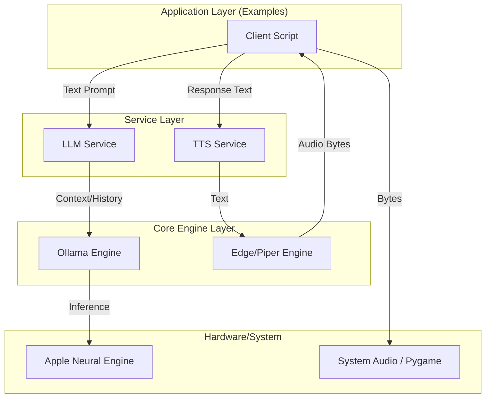

# Self-Hosted LLM Voice Assistant


An enterprise-grade, privacy-focused voice assistant framework designed for **Apple Silicon** and local environments. It strictly decouples **Language Modeling (LLM)** from **Text-to-Speech (TTS)**, allowing developers to compose powerful voice applications with zero external dependencies for data processing.

---

## 📚 Table of Contents

- [Introduction](#introduction)
- [Key Features](#key-features)
- [Architecture](#architecture)
- [Folder Structure](#folder-structure)
- [Getting Started](#getting-started)
  - [Prerequisites](#prerequisites)
  - [Installation](#installation)
- [Usage](#usage)
  - [Basic Text Mode](#basic-text-mode)
  - [Streaming Mode](#streaming-mode)
  - [Voice Integration](#voice-integration)
- [Configuration](#configuration)
- [Roadmap](#roadmap)
- [Contributing](#contributing)
- [License](#license)

---

## 👋 Introduction

The **Self-Hosted LLM Voice Assistant** is a modular framework built to bring low-latency, conversational AI to local hardware. Unlike cloud-based solutions (Siri, Alexa), this project runs entirely on your device, ensuring **100% data privacy** and **no subscription fees**.

It leverages **Ollama** for efficient LLM inference and supports multiple TTS engines (Edge-TTS, Piper) with a focus on modularity. Whether you need a simple chatbot, a streaming assistant, or a full voice interface, this framework provides the building blocks.

---

## 🚀 Key Features

- **Strict Service Decoupling**: LLM and TTS logic are isolated in independent services (`services/llm` and `services/tts`). Zero spaghetti code.
- **Dual Response Modes**: Support for both **full-text buffering** (for coherence) and **streaming tokens** (for low latency).
- **In-Memory Audio Pipeline**: Audio is generated as raw bytes and played directly from memory. No temporary files or disk I/O latency.
- **Apple Silicon Optimized**: Native Metal support via Ollama for blazing fast inference on M1/M2/M3/M4 chips.
- **Pluggable Engines**:
  - **LLM**: Switch between Ollama, LlamaCpp, or generic APIs easily.
  - **TTS**: Swap between Edge-TTS (high quality online) and Piper (100% offline).

---

## 🏗 Overall Architecture

The system follows a CLEAN architecture pattern, separating core engines from business logic services. Integration happens only at the application layer (Examples).



---

## 📂 Folder Structure

We maintain a flat, predictable structure for ease of navigation.

```bash
self-host-llm/
├── config/              # Centralized configuration (Models, Voice params)
├── core/                # Low-level wrappers for external tools (Ollama, EdgeTTS)
├── services/            # Pure Business Logic
│   ├── llm/             # LLM Service (State management, History)
│   └── tts/             # TTS Service (Stateless text-to-bytes)
├── utils/               # Shared Utilities (Audio Player, Text Processing)
├── examples/            # 🟢 READY-TO-RUN Examples (Start Here!)
├── tests/               # Unit and Integration verification scripts
└── requirements.txt     # Python dependencies
```

---

## ⚡️ Getting Started

### Prerequisites

- **macOS** (Recommended) or Linux.
- **Python 3.10+** installed.
- **Ollama** installed and running (`brew install ollama`).

### Installation

1.  **Clone the repository**

    ```bash
    git clone https://github.com/yourusername/self-host-llm.git
    cd self-host-llm
    ```

2.  **Create a Virtual Environment**

    ```bash
    python -m venv venv
    source venv/bin/activate
    ```

3.  **Install Dependencies**

    ```bash
    pip install -r requirements.txt
    ```

4.  **Download Model**
    Ensure Ollama is running and pull your preferred model:
    ```bash
    ollama pull mistral-small
    ```

---

## 🎮 Usage

We provide **4 distinctive examples** demonstrating how to compose the services.

### 1. Basic Text Mode

Simple Q&A with full-text response.

```bash
python examples/01_basic_text.py
```

### 2. Streaming Mode

ChatGPT-style typewriter effect.

```bash
python examples/02_streaming_text.py
```

### 3. Text with Audio

Generates the full answer, then reads it aloud. Best for short, coherent answers.

```bash
python examples/03_text_with_audio.py
```

### 4. Streaming + Audio (Post-Collection)

Streams text to the screen for immediate visual feedback, while buffering for audio playback at the end.

```bash
python examples/04_streaming_and_audio.py
```

---

## 🧩 Core Services API

The repository's core value lies in its clean, decoupled Service APIs. These services abstract away the complexity of underlying engines.

### 1. `LLMService`

Located in `services/llm/llm_service.py`. Handles conversational state and text generation.

```python
from services.llm.llm_service import LLMService

llm = LLMService(config)

# 1. Manage Conversation History
llm.add_user_message("Hello!")
llm.add_assistant_message("Hi there.")

# 2. Generate Full Text (Blocking)
response = llm.generate_text()
# Returns: "I am a helpful assistant..."

# 3. Generate Stream (Iterator)
for chunk in llm.generate_stream():
    print(chunk, end="", flush=True)
# Yields: "I", " am", " a", " helpful"...
```

### 2. `TTSService`

Located in `services/tts/tts_service.py`. Stateless service for audio synthesis.

```python
from services.tts.tts_service import TTSService

tts = TTSService(config)

# Convert Text to Audio Bytes (In-Memory)
audio_data = tts.generate_audio("Hello world")

if audio_data:
    # Play directly or save to file
    AudioPlayer.play_audio_data(audio_data)
```

---

## ⚙️ Env Configuration

Configuration is managed via Python dataclasses in `config/`. You can override defaults via CLI arguments in the examples.

| Module  | File                     | Key Settings                                                             |
| :------ | :----------------------- | :----------------------------------------------------------------------- |
| **LLM** | `config/model_config.py` | `model_name` (default: `mistral-small`), `temperature`, `context_window` |
| **TTS** | `config/tts_config.py`   | `engine` (edge-tts/piper), `voice`, `rate`, `pitch`                      |

**Example Config Override (CLI):**

```bash
python examples/03_text_with_audio.py --model llama3 --tts-engine piper
```

---

## 🗺 Roadmap

- [x] **Phase 1**: Core Engine Implementation (Ollama + EdgeTTS)
- [x] **Phase 2**: Service Decoupling & Modularization
- [x] **Phase 3**: In-Memory Audio Pipeline (Zero-Latency)
- [ ] **Phase 4**: Web Interface (Next.js/React)
- [ ] **Phase 5**: Wake Word Detection

---

## 🤝 Contributing

We welcome contributions from the community!

1.  Fork the project.
2.  Create your feature branch (`git checkout -b feature/amazing-feature`).
3.  Commit your changes (`git commit -m 'Add some amazing feature'`).
4.  Push to the branch (`git push origin feature/amazing-feature`).
5.  Open a Pull Request.

---

## � License

Distributed under the MIT License. See `LICENSE` for more information.

---

_Built with ❤️ for privacy and local AI._
